<!-- paste this into the README.md of your YOUR_USERNAME/YOUR_USERNAME repo -->

  <picture>
    <source media="(prefers-color-scheme: dark)" srcset="./crawler-dark.svg">
    <source media="(prefers-color-scheme: light)" srcset="./crawler-light.svg">
    
  </picture>

